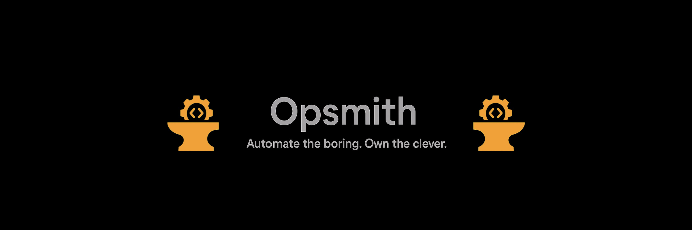

<p align="center">
  
</p>
<p align="center">
  Opsmith is a curated forge of elegant, minimal, and powerful developer tools and scripts.
</p>

---
<div align="center">

## What is Opsmith?

**Opsmith** is a collection of handcrafted tools designed to simplify common developer workflows — from automation to summarization, extraction, and orchestration. Each tool is built to be:

- 🛠 **Minimal** – no bloat, just essentials  
- ⚡ **Efficient** – optimized for fast execution  
- 💡 **Clever** – smart defaults, helpful features  
- 💬 **Human-centric** – usable, readable, and maintainable

Whether you're processing videos, generating summaries, managing your dev setup, or automating mundane tasks — Opsmith's tools are ready to serve.

---

## Current Tools

| Tool Name     | Description                                                                 | Status  |
|--------------|-----------------------------------------------------------------------------|---------|
| `VIDSUMMARY` | Extracts audio, transcribes it, and generates clean markdown summaries with cheatsheets.| ✅ Live |
| `...`        | More tools to be added soon. Stay tuned.                                    | 🚧 WIP  |

---

## Installation

Each tool lives in its own subfolder or script file. To use a specific tool:

</div>

```bash
git clone https://github.com/rajin-khan/opsmith.git
cd opsmith/<tool-folder>
````

<div align="center">

Follow the `README.md` inside each tool’s folder for setup and usage.

---

## Why “Opsmith”?

A **smith** crafts with precision and care.
**Opsmith** does the same — for your scripts, workflows, and developer life.

---

## Inspiration & Philosophy

This project draws inspiration from:

* [Unix philosophy](https://en.wikipedia.org/wiki/Unix_philosophy) – "Do one thing well"
* Developers who value elegant automation
* The joy of building tools that feel like magic ✨

---

## Contributing

Have an idea or a neat tool you want to share?
Pull requests are welcome!

* See [`CONTRIBUTING.md`](./documentation/CONTRIBUTING.md) for guidelines
* Please follow our [`Code of Conduct`](./documentation/CODE_OF_CONDUCT.md)

---

## License

MIT License.
Use it, tweak it, ship it. Just don’t be evil.

---

<p align="center">
  Made by <a href="https://github.com/rajin-khan">Rajin Khan</a>
</p>

---